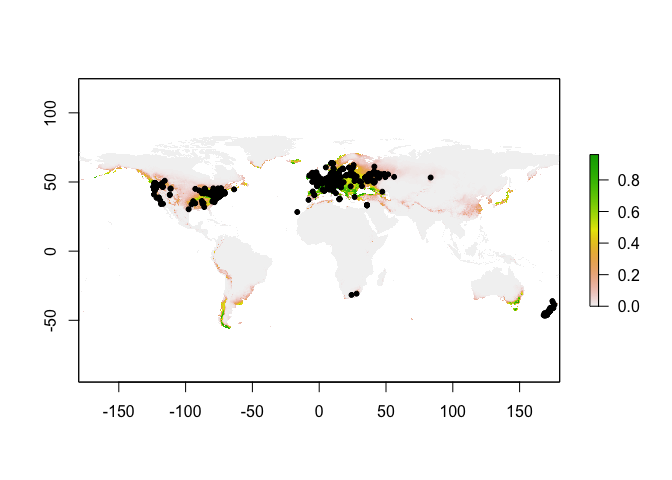
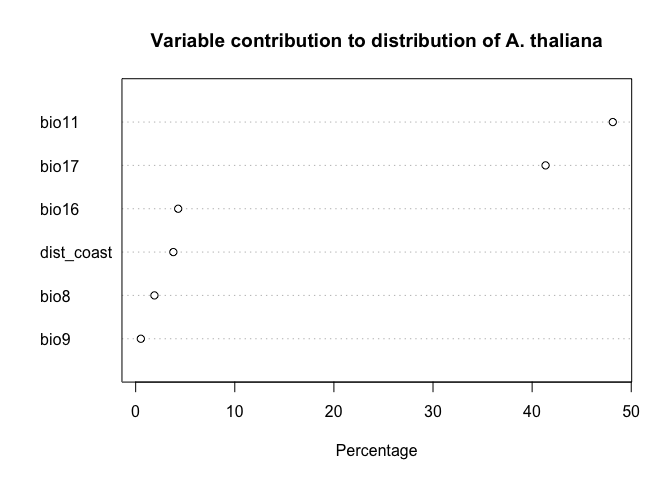
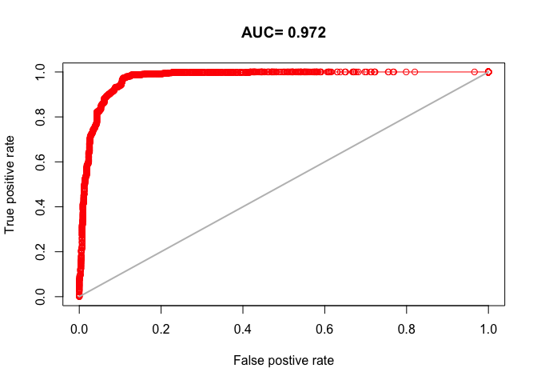
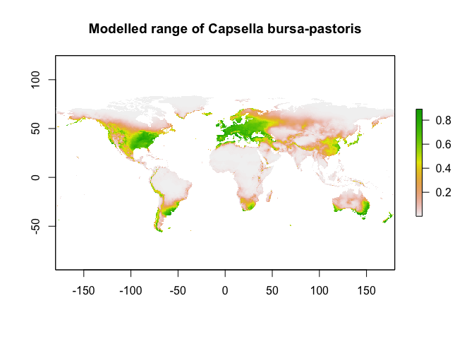
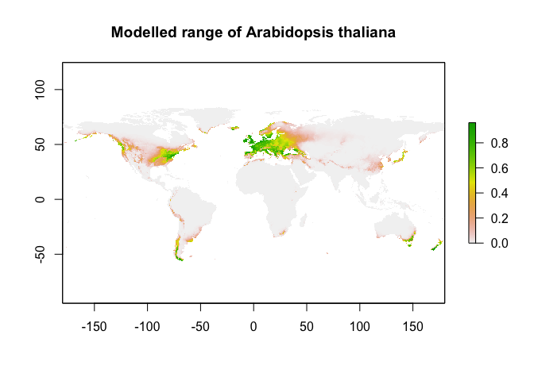
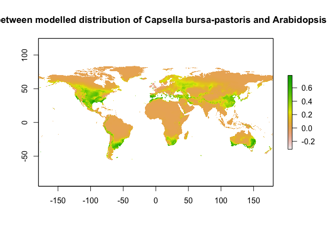

### Arabadopsis occurance data
Start by cleaning the occurance data of _Arabadopsis thaliana_ downloaded from iNaturalist.

The query parameters for the dataset were
- __research grade observations__ I figure _A. thaliana_ is common enough that I will still have a great number of observations but fewer erroneous observations, as people tend to think everything is _A. thaliana_.
- __plants only__ as a failsafe... a bit unnecessary


```r
#load Arabidopsis data
obs <- read.csv("~/Documents/Josephs_lab/salt_datasets_Rdata_images/at_observations-88914.csv")
```

Less than 1,000 observations is actually much less than I thought. I might make all observations valid. Later.

#### Cleaning observation data

```r
# keep only observations that have location data
obs=subset(obs, !is.na(longitude) & !is.na(latitude))

# find and eliminate duplicate locations
ardups=duplicated(obs[, c("longitude", "latitude")])
ar_nodups <-obs[!ardups, ]
```

All of the obersvations had location data, and only 17 observations were duplicate locations.

I subset the data for running the model later. 50% will be withheld for testing the model. 50% for training the model

```r
#load library needed for kfold
library(dismo)
```

```
## Loading required package: raster
```

```
## Warning: package 'raster' was built under R version 3.5.2
```

```
## Loading required package: sp
```

```
## Warning: package 'sp' was built under R version 3.5.2
```

```r
# make datafram with only location data
ar_locs=cbind.data.frame(ar_nodups$longitude,ar_nodups$latitude)

# withold 50% of the data for testing the model
fold <- kfold(ar_locs, k=2)
at_test <- ar_locs[fold == 1, ]
at_train <- ar_locs[fold != 1, ]
```

### Running Maximum Entropy model with removing duplicate points


```r
# run the model, with a single occurance per pixel
ar.me <- maxent(x=coastclim, p =at_train, path=paste0("/mnt/scratch/wils1582/salt/cbp_distr_mod"), args=c("responsecurves", "jackknife","pictures"),  removeduplicates=TRUE, writeplotdata=TRUE)

# use model to predict distribution raster
ar.predict <- predict(ar.me, coastclim)
```

Save relevant objects from HPCC to an Rdata file and download it locally to load here.

```r
load("~/Documents/Josephs_lab/salt_datasets_Rdata_images/art_model.Rdata")
```


Take a look at the model to make sure it looks reasonable. Sanity check.

```r
#plot the rasterlayer predicted by the model
plot(ar.predict)

#add actual occurance points on top
points(ar_locs, pch=20)
```

<!-- -->

Okay, makes sense! The model predicts _Arabidopsis thaliana_ occurs in places that...it..occurs...

### Model Exploration
Look at the relative contributions of each variable to the model

```r
# plot the contribution of each variable 
plot(ar.me, main="Variable contribution to distribution of A. thaliana")
```

<!-- -->


BIOCLIM variable 11 (mean temperature of the coolest quarter) contrubutes the most, nearly 50%. Followed by BIOCLIM 17 (precipitation of the driest quarter)

### Model Evaluation

```r
# create background data points
bg <- randomPoints(coastclim, 1000)

#simplest way to use 'evaluate'
ar.e1 <- evaluate(ar.me, p=at_test, a=bg, x=coastclim)
```


```r
threshold(ar.e1)
```

```
##                kappa spec_sens no_omission prevalence equal_sens_spec
## thresholds 0.1597818 0.1597818  0.00104902   0.325925       0.2663301
##            sensitivity
## thresholds   0.3494434
```

kappa: threshold at which kappa is highest

spec_sens: threshold at with the sum of sensitivity and specificity are the highest

- sensitivity = true __positive__ rate

- specificity = true __negative__ rate

no_omission: highest threshold at which there is no omission

prevalence: modeled prevalence is closest to observed prevalence

equal_sens_spec: equal sensitivity and specificity

sensitivty: fixed (specified) sensitivity


```r
# plot reciever operating characteristic of model
plot(ar.e1, 'ROC')
```

<!-- -->


### Distribution of _A. thalinana_ vs. _Capsella bursa-pastoris_


```r
#loading the Capsella MAXENT data for plotting
load("~/Documents/Josephs_lab/salt_datasets_Rdata_images/modelling_cbp_distributions.RData")
```


```r
#plot capsella maxent output
plot(cbp.pred, main="Modelled range of Capsella bursa-pastoris")
```

<!-- -->


```r
#plot arabidopsis maxent output
plot(ar.predict, main="Modelled range of Arabidopsis thaliana")
```

<!-- -->


```r
#use pverlay function (for large rasterlayers) to subtract the Arabidopsis distrubution from the Capsella distrubution.
diff_ovr <- overlay(cbp.pred, ar.predict, fun=function(r1, r2){return(r1-r2)})

#plot the difference
plot(diff_ovr, main="Difference between modelled distribution of Capsella bursa-pastoris and Arabidopsis thaliana")
```

<!-- -->

Unfortunately, the color gradients between the indivudual model output plots and this one are not exactly the same. I interpret this to show areas in which _C. bursa-pastoris_ occurs and _A. thaliana_ does not.

*need to insert jacknife results*
