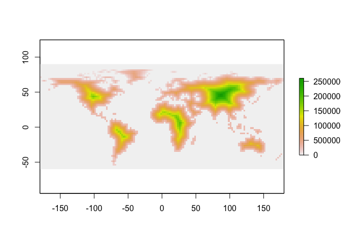
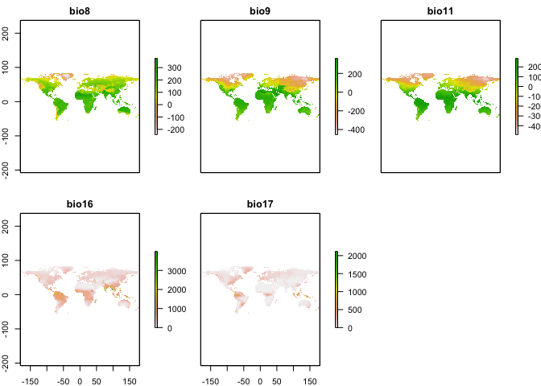
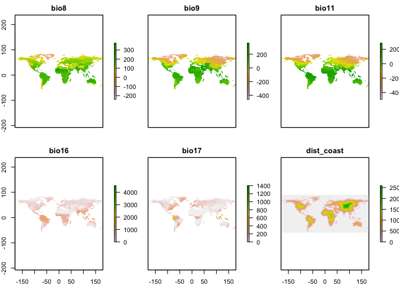
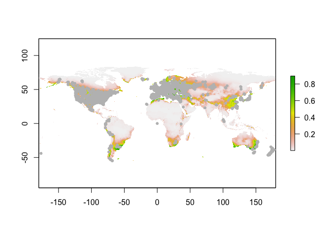
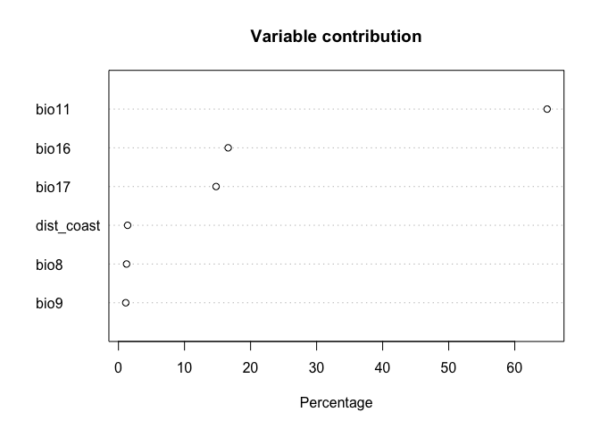
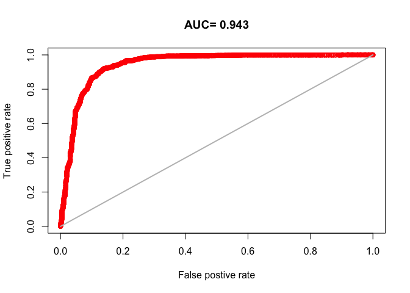

### Capsella occurance data


```r
#Load R data for knitting
load("~/Documents/Josephs_lab/salt_datasets_Rdata_images/modelling_cbp_distributions.RData")
```


```r
# read inaturalist data
obs <- read.csv("~/Documents/Josephs_lab/salt_datasets_Rdata_images/cbp-observations-81425.csv")

# get rid of inaturalist observations without location information
cbp=subset(obs, !is.na(longitude) & !is.na(latitude))

# find and eliminate duplicate locations
cbpdups=duplicated(cbp[, c("longitude", "latitude")])
cbp_nodups <-cbp[!cbpdups, ]

#load library needed for kfold
library(dismo)
```

```
## Loading required package: raster
```

```
## Warning: package 'raster' was built under R version 3.5.2
```

```
## Loading required package: sp
```

```
## Warning: package 'sp' was built under R version 3.5.2
```

```r
# withold 20% of the data for testing the model
occr=cbind.data.frame(cbp_nodups$longitude,cbp_nodups$latitude)
fold <- kfold(occr, k=5)
cbptest <- occr[fold == 1, ]
cbptrain <- occr[fold != 1, ]
```

### Create raster layer of distance from coastlines
from an [answer](https://stackoverflow.com/questions/35555709/global-raster-of-geographic-distances "Global Raster of Geographic Distances") on StackOverflow.

```r
library(raster)
library(maptools)
```

```
## Warning: package 'maptools' was built under R version 3.5.2
```

```
## Checking rgeos availability: TRUE
```

```r
data(wrld_simpl)

# Create a raster template for rasterizing the polygons. 
# (set the desired grid resolution with res)
r <- raster(xmn=-180, xmx=180, ymn=-60, ymx=90, res=2.5)

# Rasterize and set land pixels to NA
r2 <- rasterize(wrld_simpl, r, 1)
r3 <- mask(is.na(r2), r2, maskvalue=1, updatevalue=NA)

# Calculate distance to nearest non-NA pixel
d <- distance(r3)
```

__d__ is now a raster layer of distance from coastline.

I am later going to combine it with a raster stack of bioclimate variables so I will chance the layer to a stack now.

This is also a workaround for if you'd like to use MAXENT using only 1 predictor variable. 

Workaround from StackOverflow [answer](https://stackoverflow.com/questions/47599192/maxent-error-in-match-namesclabs-namesxi-names-do-not-match-previous-nam).


```r
# create a raster stack with the single raster layer
prd <- stack(d[[1]])

# Check that things look okay.
plot(prd)
```

<!-- -->

### Create raster stack of BIOCLIM variables


```r
# Download World Bioclimatic data
biovars=getData("worldclim", var="bio", res=2.5)

# Drop bioclim variables we do not want
biovars=dropLayer(biovars, c("bio1","bio2","bio3","bio4","bio5","bio6","bio7","bio10","bio12","bio13","bio14","bio15","bio18","bio19"))
```

I have randomly kept the following bio climate variables
  * Bio8: mean temperature of the wettest quarter
  * Bio9: mean temperature of the driest quarter
  * Bio11: mean temperature of the coolest quarter
  * Bio16: precipitation of  the wettest quarter
  * Bio17: precipiation of the driest quarter


```r
plot(biovars)
```

<!-- -->

### Combine Bioclim Stack with Coastal Stack

The biclim and coastal layers have different dimentions so I first need to make them match, then I stack them.


```r
library(raster)
# Resample coastal layer to match dimensions
prd <- resample(prd, biovars)

#combine the bioclim variables with the distance from coast raster stack
coastclim <- stack(biovars, prd)

#check names of raster stack layers
labels(coastclim)
```

```
## [1] "bio8"  "bio9"  "bio11" "bio16" "bio17" "layer"
```

```r
#rename the distance from coast layer
names(coastclim)[6] <- "dist_coast"

plot(coastclim)
```

<!-- -->

Information on loading own libraries on HPCC can be found [here](https://wiki.hpcc.msu.edu/display/ITH/Installation+of+R+Libraries "Installation of R Libraries") on the MSU HPCC wesbite.
Link: <https://wiki.hpcc.msu.edu/display/ITH/Installation+of+R+Libraries>

```r
# To run in command line
# set library
export R_LIBS_USER=~/R_Lib/3.5.1-foss-2018a-X11-20180131
```

Run following chunk in R to check the library is correct. It should return __"~/R_Lib/3.5.1-foss-2018a-X11-20180131"__


```r
Sys.getenv("R_LIBS_USER")
```

Load environment and necessary packages.


```r
#load Rdata space
load("model_dist.RData")

#Load necessary packages
library(raster)
library(dismo)
library(rJava)
```

### Running the model __without__ removing duplicate cells.


```r
# Train the model
cbp.me <- maxent(x=coastclim, p =cbptrain, path=paste0("/mnt/scratch/wils1582/salt/cbp_distr_mod"), args=c("responsecurves", "jackknife","pictures"),  removeduplicates=FALSE, writeplotdata=TRUE)
mk

# Predict environmental occurance layers
cbp.predict <- predict(cbp.me, coastclim)

#save the R workspace image (if you want)
save.image(file="model2.Rdata")
```
__NOTE:__ After running the above chunk, I get this warning message.
Warning message:
In .local(x, p, ...) :
  6 (0.14%) of the presence points have NA predictor values
  
### With removing duplicate cells

For unknown (yet) reasons, some people run MAXENT with only one occurace point per pixel/cell on the  raster stack.

This can be done by passing the argument "removeduplicates=TRUE" to the maxent function.

```r
# Train the model
cbp3.me <- maxent(x=coastclim, p =cbptrain, path=paste0("/mnt/scratch/wils1582/salt/cbp_distr_mod"), args=c("responsecurves", "jackknife","pictures"),  removeduplicates=TRUE, writeplotdata=TRUE)

# predict environmental occurance layers
cbp3.predict <- predict(cbp3.me, coastclim)

#save the R workspace image (if you want)
save.image(file="model3.Rdata")
```

## Analysis of models


```r
#plot the rasterlayer predicted by model 2
plot(cbp.pred)

#add actual occurance points on top
points(occr, pch=20, col="grey")
```

<!-- -->


```r
#plot the rasterlayer predicted by model 3
plot(cbp3.predict)

#add actual occurance points on top
points(occr, pch=20, col="grey")
```

<!-- -->

The predicted areas in which _Capsella bursa-pastoris_ is suited to exist. 


The predictions between model 2 (not having a single observation per pixel) and model 3 (only one observation per pixel) look the same to me. So maybe we will continue with model 3 because it seems closer to a best practice.


```r
# Plot the contribution of each variable 
plot(cbp3.me)
```

<!-- -->

If we are plainly looking at the contribution of each variable to the model, it would appear that the bioclim variable 11, mean temperature of the coolest quarter, contributes far more than the others. Bio16 and Bio17 appear to contrubute a significant amount, which are precipitation in the wettest and driest quarter respectivley.

So, perhaps the distribution of Capsella bursa-pastoris is mainly limited by the coldest temperature and total precipitation. I don't know how different that is compared to other weedy species so it might be fun to look at other


```r
# create background data points
bg <- randomPoints(coastclim, 1000)

#simplest way to use 'evaluate'
e1 <- evaluate(cbp3.me, p=cbptest, a=bg, x=coastclim)

# alternative 1
# extract presence and absence values
#Instead of making these data frames, they might alreadye exist an output from maxent?
pvtest <- data.frame(extract(coastclims, cbptest))
avtest <- data.frame(extract(coastclim, bg))

e2 <- evaluate(cbp3.me, p=pvtest, a=avtest)

# alternative 2 
# predict to testing points 
testp <- predict(cbp3.me, pvtest) 
head(testp)
testa <- predict(cbp3.me, avtest) 

e3 <- evaluate(p=testp, a=testa)
e3
```


```r
threshold(e1)
```

```
##                kappa spec_sens no_omission prevalence equal_sens_spec
## thresholds 0.3232244 0.4843337  0.00160611  0.6427588       0.5282555
##            sensitivity
## thresholds   0.5114439
```


```r
threshold(e2)
```

```
##                kappa spec_sens no_omission prevalence equal_sens_spec
## thresholds 0.3232244 0.4843337  0.00160611  0.6427588       0.5282555
##            sensitivity
## thresholds   0.5114439
```


```r
threshold(e3)
```

```
##                kappa spec_sens no_omission prevalence equal_sens_spec
## thresholds 0.3232244 0.4843337  0.00160611  0.6427588       0.5282555
##            sensitivity
## thresholds   0.5114439
```

Despite the method for evaluating the model, all the model evaluations have exactly the same values (which is comforting and expected).

### Model Evaluation TBC...

```r
plot(e3, 'ROC')
```

<!-- -->
